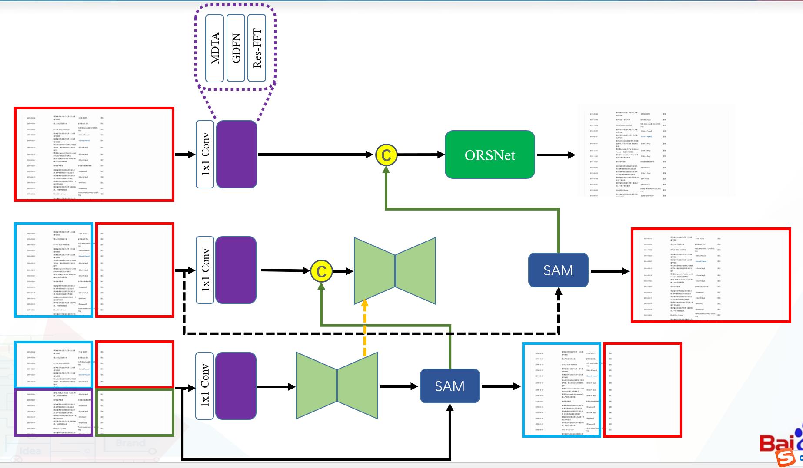
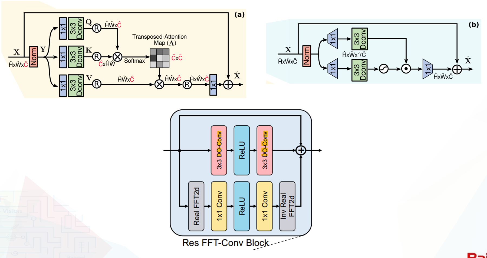
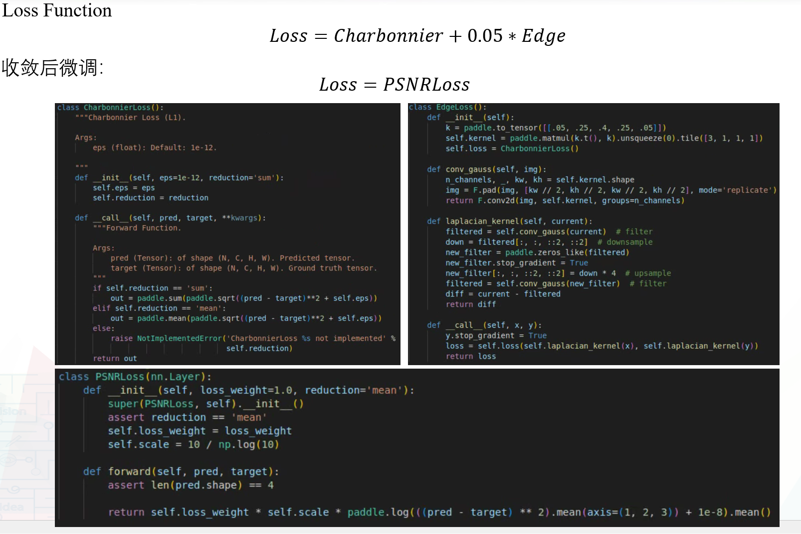
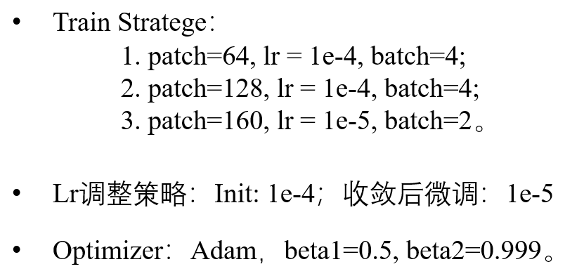
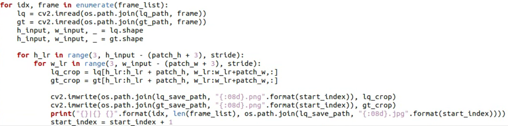
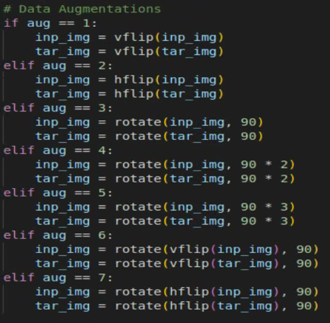

# 百度网盘AI大赛-模糊文档图像恢复第3名方案
## 简介
> 这是我们参加百度去[模糊文档图像](https://aistudio.baidu.com/aistudio/competition/detail/349/0/introduction)的代码与模型，主要参考了[Restormer](https://arxiv.org/abs/2111.09881)以及[MPRNet](https://arxiv.org/abs/2102.02808)，在[PaddleGAN](https://github.com/PaddlePaddle/PaddleGAN.git)的基础上进行训练.

## 网络结构
<p align="center">
  
</p>

我们首先依然采用MPRNet作为一个整体的网络结构，因为他考虑了一种多阶段复杂的退化过程，比直接使用UNet的形式更好。原始的网络在提取浅层特征时，使用CAB(Channel Attention Block)，但是该模块会带来很大的参数量。同时，卷积神经网络的感受野其实在深层时并没有我们想象的高，所以我们考虑使用可解释较强的Transformer Block来提取特征，在一开始就使用其中的全局Attention，具体来说，我们使用Restormer中的Block来对CAB进行了替换。其他的结构基本一直。

## 改进的Transfomer Block
<p align="center">
  
</p>

在使用Restormer中的Transformer Block对CAB进行替换后，我们考虑继续对该模块进行改进。比较满意的一次改进是在后面增加一个Res FFT-conv Block，该模块内会对特征进行傅里叶变换，转换为一种频域的特征，然后再通过残差结构进行连接，这样网络可以更容易学习频域方面的特征。同时，为了增加网络运算速度，我们参考实现了Paddle版本的[DO-conv](https://zhuanlan.zhihu.com/p/444459615)，加快了运算速度。


## Loss Function
<p align="center">
  
</p>

这里还是采用和MPRNet中一样的策略，但是在收敛后，我们使用PSNRLoss对模型进行微调，在验证服务器上效果有了非常显著的提升。

## 训练策略
<p align="center">
  
</p>

先使用128的小patch进行快速训练，学习率为1e-4，之后逐渐增加patch的大小，同时减小学习率。同时不建议在本次比赛中使用过大的patch（512以上）。


## 代码组织结构介绍  
> work   
&emsp;|-----mpr_mdta_v8.py  
&emsp;|-----predict.py    
&emsp;|-----utils.py  
&emsp;|-----doconv.py 

本次比赛我们使用的是[PaddleGAN](https://github.com/PaddlePaddle/PaddleGAN.git)训练组件，这里不提供训练代码，只提供推理代码。这里需要强调的是，自己搭建的训练保存的模型和PaddleGAN保存的有一点区别，需要自己重新找一下对应的关键字：
``` python
  # utils.py line 11
  para_state_dict = paddle.load(pretrained_model)
  para_state_dict = para_state_dict['generator']

  model_state_dict = model.state_dict()
  keys = model_state_dict.keys()
```


## 数据增强/清洗策略  

对于图像处理竞赛，我们并没有放过多的精力在数据预处理上。原始输入的数据分辨率比之前的比赛还要高，所以我们使用按步长裁剪的方式，构建了512 x 512的pair，然后再从这些pair中随机选取块进行训练。代码实现：
<p align="center">
  
</p>

数据增强：各种角度随机翻转
<p align="center">
  
</p>


## 小结：核心涨分策略
- 使用Restormer中的Block替换CAB，缺点就是我们放弃了性能分数。
- 使用不同的PSNRLoss进行微调，效果非常显著。
- 训练数据按照步长裁剪后，在从中随机选取训练。


## 安装运行环境
  ```
  pip install -r requirements.txt
  ```

## 下载预训练模型
Baidu disk: https://pan.baidu.com/s/180-GLw5XG_8FpzbMJ3noYA

password: 2jfa

下载后放在predict.py的同级目录下。


## 推理预测
  ```python
  python predict.py
  ```